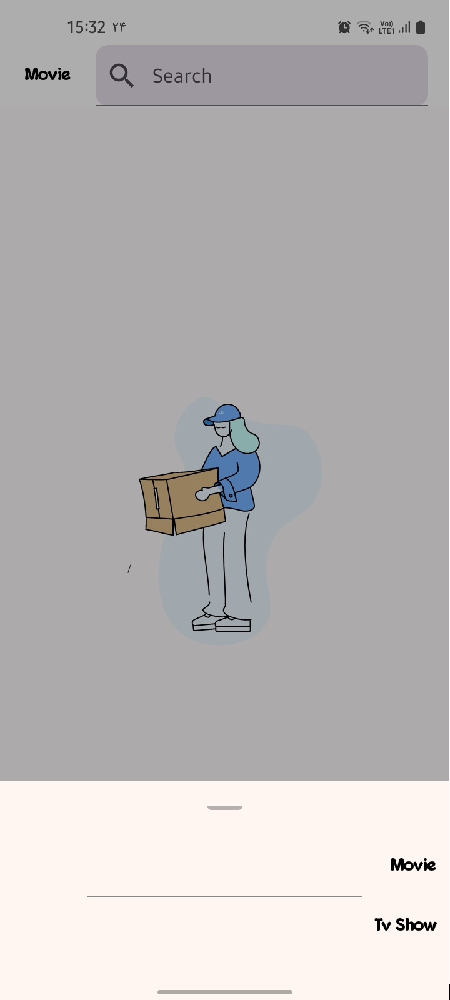
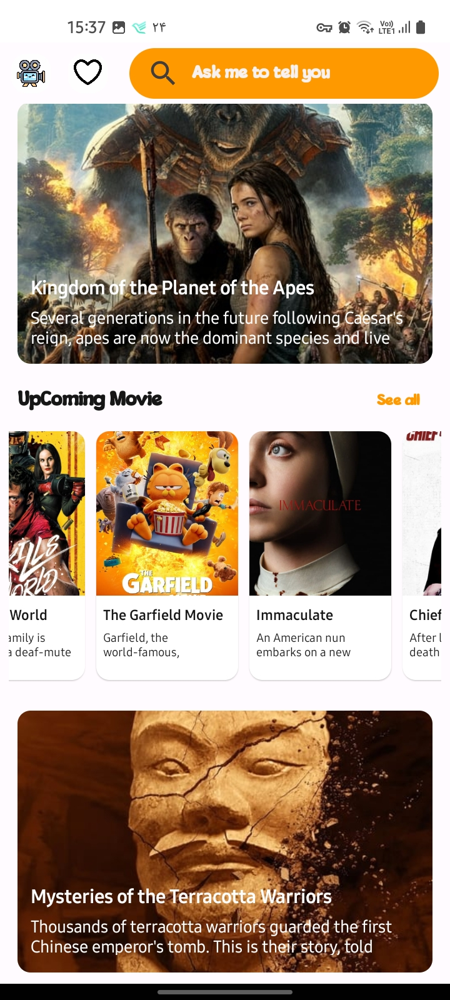
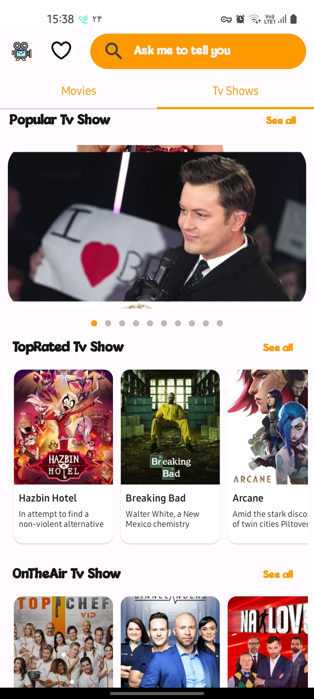

# RollMovie 😊😊
Wonderful app for follow movie or show that are popular and trend in the world
# Preview

# Getting Started
You can Generate a api key for yourself [The Movie Database](https://www.themoviedb.org/)
put your api key in local.property or a file that you put it in gitignore 🙌🙌🙌

# Ui
I used jetpack compose for this project and all component are sorted very well
The RollMovie app only has one theme (light theme)

# Algorithm
